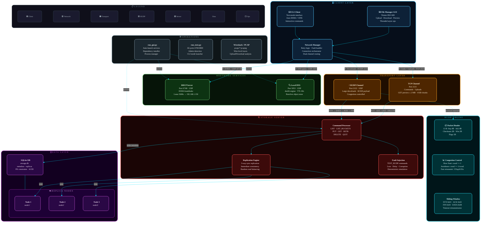

# Network Architecture — Distributed Object Storage System

```mermaid
%%{init: {'theme': 'dark', 'themeVariables': {'primaryColor': '#0f0f1a', 'primaryTextColor': '#e8eaed', 'primaryBorderColor': '#1a73e8', 'lineColor': '#00e5ff', 'secondaryColor': '#1a1a2e', 'tertiaryColor': '#162447', 'fontFamily': 'Segoe UI, Roboto, sans-serif', 'fontSize': '13px'}, 'flowchart': {'curve': 'basis', 'padding': 28, 'nodeSpacing': 55, 'rankSpacing': 50}}}%%

flowchart TB

%% ── CLIENT LAYER ──────────────────────────────
subgraph CLIENT["🖥️  C L I E N T · L A Y E R"]
  direction LR
  GUI["🖼️ <b>File Manager GUI</b><br/>Tkinter 850×600<br/>Upload · Download · Preview<br/>Threaded async ops"]
  CLI["⌨️ <b>CLI Client</b><br/>Text-mode interface<br/>Auto DORA + DNS<br/>Interactive commands"]
  NETMGR["🔌 <b>Network Manager</b><br/>Retry logic · Fault handler<br/>Connection orchestrator<br/>Dual-channel routing"]
  GUI --> NETMGR
  CLI --> NETMGR
end

%% ── NETWORK SERVICES ─────────────────────────
subgraph NETSVCS["🌐  N E T W O R K · S E R V I C E S"]
  direction LR
  DHCP["📡 <b>DHCP Server</b><br/>Port 67/68 · UDP<br/>DORA handshake<br/>Lease 3600s → 192.168.1.150"]
  DNS["🔍 <b>Local DNS</b><br/>Port 5053 · UDP<br/>dnslib engine · TTL 60s<br/>Resolves object.store"]
end

%% ── TRANSPORT LAYER ──────────────────────────
subgraph TRANSPORT["📡  T R A N S P O R T · L A Y E R"]
  direction LR
  TCP_CH["🔗 <b>TCP Channel</b><br/>Port 2121<br/>Commands · Uploads<br/>GET preview ≤ 2 MB · 4 KB chunks"]
  RUDP_CH["⚡ <b>RUDP Channel</b><br/>Port 2122 · UDP<br/>Large downloads · 60 KB payload<br/>Congestion controlled"]
end

%% ── RUDP ENGINE ──────────────────────────────
subgraph RUDP_DETAIL["🧬  R U D P · E N G I N E"]
  direction LR
  HDR["📦 <b>Packet Header</b><br/>13 B: Seq 4B · Ack 4B<br/>Checksum 2B · Win 2B<br/>Flags 1B"]
  CONG["📊 <b>Congestion Control</b><br/>Slow Start: cwnd += 1<br/>Avoidance: cwnd += 1/cwnd<br/>Fast retransmit: 3 DupACKs"]
  FLAGS["🏁 <b>Sliding Window</b><br/>SYN 0x01 · ACK 0x02<br/>FIN 0x04 · DATA 0x08<br/>Timeout retransmission"]
  HDR ~~~ CONG ~~~ FLAGS
end

%% ── STORAGE SERVER ───────────────────────────
subgraph STORAGE_SVR["🏗️  S T O R A G E · S E R V E R"]
  direction LR
  CMD_PROC["🧠 <b>Command Processor</b><br/>LIST · LIST_BUCKETS<br/>PUT · GET · RETR<br/>DELETE · QUIT"]
  REPL_ENG["🔄 <b>Replication Engine</b><br/>3-way sync replication<br/>Immediate consistency<br/>Random read balancing"]
  FAULT_INJ["🧪 <b>Fault Injection</b><br/>TEST_RUDP commands<br/>Loss · Delay · Corruption<br/>Deterministic simulation"]
  CMD_PROC --> REPL_ENG
  CMD_PROC --> FAULT_INJ
end

%% ── DATA LAYER ───────────────────────────────
subgraph DATA["🗄️  D A T A · L A Y E R"]
  direction LR
  SQLITE["💾 <b>SQLite DB</b><br/>storage.db<br/>metadata · replicas<br/>FK constraints · ACID"]
  subgraph REPLICAS["☁️  R E P L I C A · N O D E S"]
    direction LR
    N1["📁 <b>Node 1</b><br/>node1/"]
    N2["📁 <b>Node 2</b><br/>node2/"]
    N3["📁 <b>Node 3</b><br/>node3/"]
  end
  SQLITE --- REPLICAS
end

%% ── OPERATIONS ───────────────────────────────
subgraph TOOLING["🛠️  O P E R A T I O N S"]
  direction LR
  RUNGUI["🚀 <b>run_gui.py</b><br/>Auto-launch services<br/>Dependency installer<br/>Process manager"]
  RUNTESTS["🧾 <b>run_tests.py</b><br/>Alt ports 6700/6800<br/>Admin detection<br/>CLI mode launcher"]
  PCAP["🦈 <b>Wireshark / PCAP</b><br/>pcaps/*.pcapng<br/>Wire-level traces<br/>Upload/Download analysis"]
end

%% ── LEGEND ───────────────────────────────────
subgraph LEGEND["📋  L E G E N D"]
  direction LR
  L1["🟦 Client"]
  L2["🟩 Network"]
  L3["🟧 Transport"]
  L4["🟪 RUDP"]
  L5["🟥 Server"]
  L6["💜 Data"]
  L7["⬜ Ops"]
  L1 ~~~ L2 ~~~ L3 ~~~ L4 ~~~ L5 ~~~ L6 ~~~ L7
end

%% ── CONNECTIONS ──────────────────────────────

NETMGR -- "① DORA · UDP :67/:68" --> DHCP
NETMGR -- "② DNS query · UDP :5053" --> DNS

NETMGR -- "③ Cmds + Uploads · TCP :2121" --> TCP_CH
NETMGR -- "④ Downloads · RUDP :2122" --> RUDP_CH

TCP_CH -- "PUT · GET · LIST · DELETE" --> CMD_PROC
RUDP_CH -- "SYN → DATA → ACK → FIN" --> CMD_PROC

RUDP_CH -. "protocol internals" .-> HDR

CMD_PROC -- "write metadata" --> SQLITE
REPL_ENG -- "sync" --> N1
REPL_ENG -- "sync" --> N2
REPL_ENG -- "sync" --> N3

RUNGUI -. "spawns" .-> DHCP
RUNGUI -. "spawns" .-> DNS
RUNGUI -. "spawns" .-> CMD_PROC

%% ── STYLES ───────────────────────────────────

classDef clientNode   fill:#0d2137,stroke:#4fc3f7,stroke-width:2px,color:#e1f5fe,rx:12
classDef netNode      fill:#0d3312,stroke:#66bb6a,stroke-width:2px,color:#e8f5e9,rx:12
classDef transNode    fill:#4e2600,stroke:#ffa726,stroke-width:2px,color:#fff3e0,rx:12
classDef rudpNode     fill:#003135,stroke:#26c6da,stroke-width:2px,color:#e0f7fa,rx:12
classDef serverNode   fill:#3c0a0a,stroke:#ef5350,stroke-width:2px,color:#ffebee,rx:12
classDef dataNode     fill:#2a0845,stroke:#ab47bc,stroke-width:2px,color:#f3e5f5,rx:12
classDef toolNode     fill:#1c2830,stroke:#78909c,stroke-width:2px,color:#eceff1,rx:12
classDef legendNode   fill:#1a1a2e,stroke:#455a64,stroke-width:1px,color:#b0bec5,rx:8,font-size:12px

class GUI,CLI,NETMGR clientNode
class DHCP,DNS netNode
class TCP_CH,RUDP_CH transNode
class HDR,CONG,FLAGS rudpNode
class CMD_PROC,REPL_ENG,FAULT_INJ serverNode
class SQLITE,N1,N2,N3 dataNode
class RUNGUI,RUNTESTS,PCAP toolNode
class L1,L2,L3,L4,L5,L6,L7 legendNode

style CLIENT       fill:#060e1a,stroke:#4fc3f7,stroke-width:2.5px,color:#4fc3f7,rx:16
style NETSVCS      fill:#061408,stroke:#66bb6a,stroke-width:2.5px,color:#66bb6a,rx:16
style TRANSPORT    fill:#1f0e00,stroke:#ffa726,stroke-width:2.5px,color:#ffa726,rx:16
style RUDP_DETAIL  fill:#001519,stroke:#26c6da,stroke-width:2.5px,color:#26c6da,rx:16
style STORAGE_SVR  fill:#1a0505,stroke:#ef5350,stroke-width:2.5px,color:#ef5350,rx:16
style DATA         fill:#120020,stroke:#ab47bc,stroke-width:2.5px,color:#ab47bc,rx:16
style REPLICAS     fill:#1d0035,stroke:#9c27b0,stroke-width:1.5px,color:#ce93d8,rx:12
style TOOLING      fill:#0e1518,stroke:#78909c,stroke-width:2.5px,color:#90a4ae,rx:16
style LEGEND       fill:#0f0f1a,stroke:#37474f,stroke-width:1.5px,color:#78909c,rx:12
```
